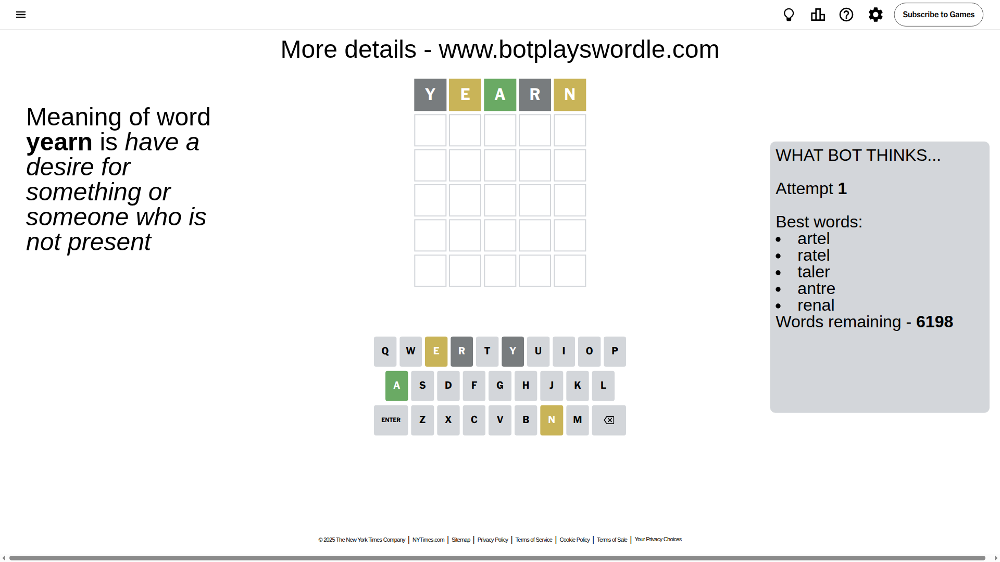
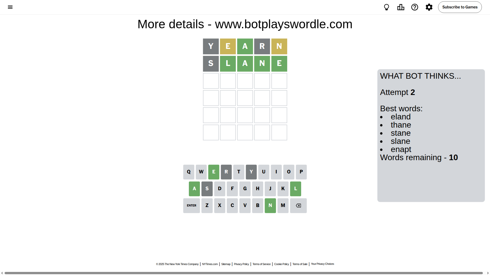
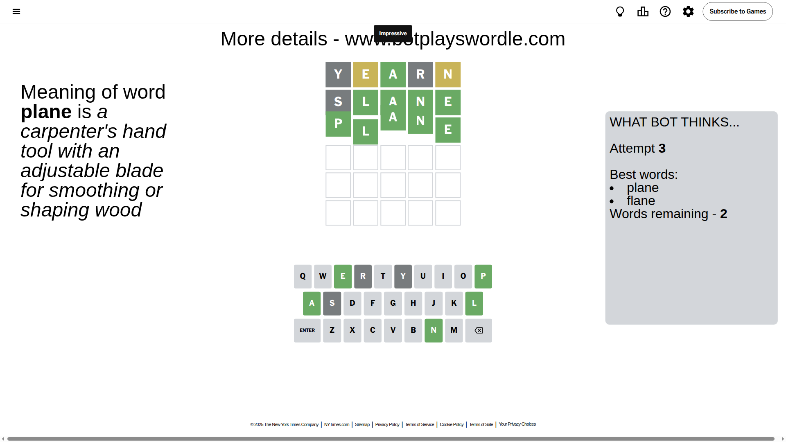

# Wordle for October 5, 2025 - \#1569

## Attempt 1

This is the first attempt and we'll choose a random word to start with.

Let's start with word `yearn`

Attempt for `yearn` gives us 1 correct letters, 2 present letters and 2 wrong letters.

If we look into details, we can see that:

Letter `y` is not present in the word and we will not use it any more

Letter `e` is on a different spot - this means that it cannot be at position 2

Letter `a` should be at position 3

Letter `r` is not present in the word and we will not use it any more

Letter `n` is on a different spot - this means that it cannot be at position 5

We got information about the correct letters and it should make next attempt easier

Some letters are missing (like `y`, `r`) but it's also important piece of information

Word should contain letters `[e a n]`

That was a great guess that limited number of remaining words

## Attempt 2

Right now we have 10 words to choose from and best of them seem to be `[eland thane stane slane enapt]`

So far we know that possible letters are:

At position 1: `[a b c d e f g h i j k l m n o p q s t u v w x z]`

At position 2: `[a b c d f g h i j k l m n o p q s t u v w x z]`

At position 3: `[a]`

At position 4: `[a b c d e f g h i j k l m n o p q s t u v w x z]`

At position 5: `[a b c d e f g h i j k l m o p q s t u v w x z]`

Next guess is `slane`, let's see what it gives us

Attempt for `slane` gives us 4 correct letters, 0 present letters and 1 wrong letters.

If we look into details, we can see that:

Letter `s` is not present in the word and we will not use it any more

Letter `l` should be at position 2

Letter `n` should be at position 4

Letter `e` should be at position 5

We got information about the correct letters and it should make next attempt easier

Some letters are missing (like `s`) but it's also important piece of information

Word should contain letters `[e a n l]`

Not a bad guess in general

## Attempt 3

Right now we have 2 words to choose from and best of them seem to be `[plane flane]`

So far we know that possible letters are:

At position 1: `[a b c d e f g h i j k l m n o p q t u v w x z]`

At position 2: `[l]`

At position 3: `[a]`

At position 4: `[n]`

At position 5: `[e]`

Next guess is `plane`, let's see what it gives us

That's the correct answer! The word is `plane`!

## Conclusion

Today's word is `plane` and it took 3 attempts to guess it

