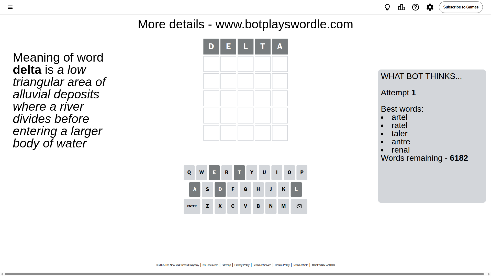
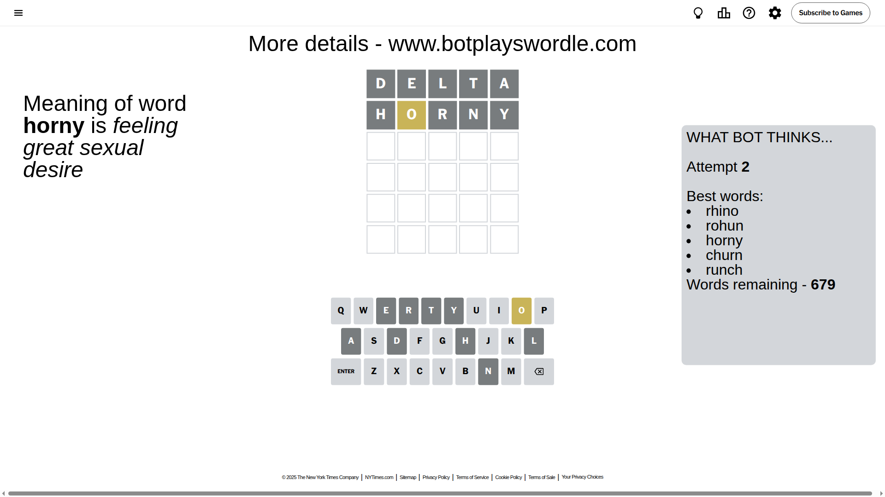
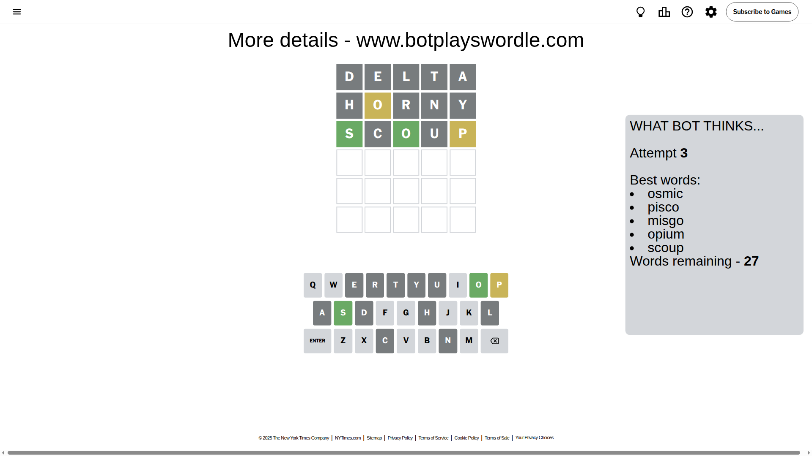
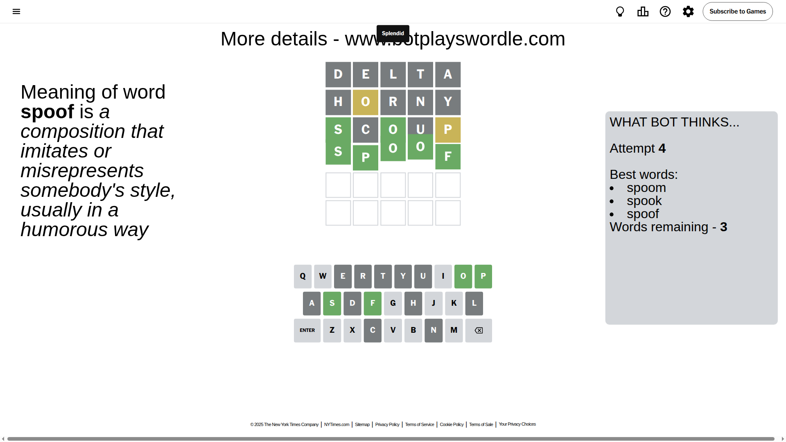

# Wordle for October 15, 2025 - \#1579

## Attempt 1

This is the first attempt and we'll choose a random word to start with.

Let's start with word `delta`

Attempt for `delta` gives us 0 correct letters, 0 present letters and 5 wrong letters.

If we look into details, we can see that:

Letter `d` is not present in the word and we will not use it any more

Letter `e` is not present in the word and we will not use it any more

Letter `l` is not present in the word and we will not use it any more

Letter `t` is not present in the word and we will not use it any more

Letter `a` is not present in the word and we will not use it any more

Some letters are missing (like `d`, `e`, `l`, `t`, `a`) but it's also important piece of information

So far we don't know any of the letters!

That was a great guess that limited number of remaining words

## Attempt 2

Right now we have 679 words to choose from and best of them seem to be `[rhino rohun horny churn runch]`

So far we know that possible letters are:

At position 1: `[b c f g h i j k m n o p q r s u v w x y z]`

At position 2: `[b c f g h i j k m n o p q r s u v w x y z]`

At position 3: `[b c f g h i j k m n o p q r s u v w x y z]`

At position 4: `[b c f g h i j k m n o p q r s u v w x y z]`

At position 5: `[b c f g h i j k m n o p q r s u v w x y z]`

Next guess is `horny`, let's see what it gives us

Attempt for `horny` gives us 0 correct letters, 1 present letters and 4 wrong letters.

If we look into details, we can see that:

Letter `h` is not present in the word and we will not use it any more

Letter `o` is on a different spot - this means that it cannot be at position 2

Letter `r` is not present in the word and we will not use it any more

Letter `n` is not present in the word and we will not use it any more

Letter `y` is not present in the word and we will not use it any more

Some letters are missing (like `h`, `r`, `n`, `y`) but it's also important piece of information

Word should contain letters `[o]`

That was a great guess that limited number of remaining words

## Attempt 3

Right now we have 27 words to choose from and best of them seem to be `[osmic pisco misgo opium scoup]`

So far we know that possible letters are:

At position 1: `[b c f g i j k m o p q s u v w x z]`

At position 2: `[b c f g i j k m p q s u v w x z]`

At position 3: `[b c f g i j k m o p q s u v w x z]`

At position 4: `[b c f g i j k m o p q s u v w x z]`

At position 5: `[b c f g i j k m o p q s u v w x z]`

Next guess is `scoup`, let's see what it gives us

Attempt for `scoup` gives us 2 correct letters, 1 present letters and 2 wrong letters.

If we look into details, we can see that:

Letter `s` should be at position 1

Letter `c` is not present in the word and we will not use it any more

Letter `o` should be at position 3

Letter `u` is not present in the word and we will not use it any more

Letter `p` is on a different spot - this means that it cannot be at position 5

We got information about the correct letters and it should make next attempt easier

Some letters are missing (like `c`, `u`) but it's also important piece of information

Word should contain letters `[o s p]`

That was a great guess that limited number of remaining words

## Attempt 4

Right now we have 3 words to choose from and best of them seem to be `[spoom spook spoof]`

So far we know that possible letters are:

At position 1: `[s]`

At position 2: `[b f g i j k m p q s v w x z]`

At position 3: `[o]`

At position 4: `[b f g i j k m o p q s v w x z]`

At position 5: `[b f g i j k m o q s v w x z]`

Next guess is `spoof`, let's see what it gives us

That's the correct answer! The word is `spoof`!

## Conclusion

Today's word is `spoof` and it took 4 attempts to guess it

