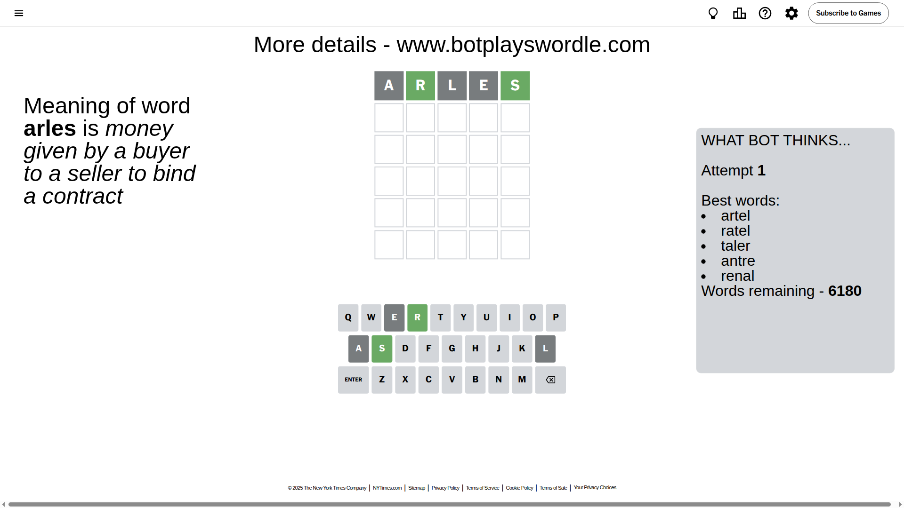
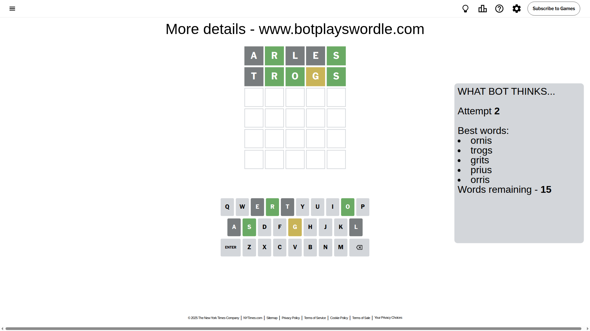
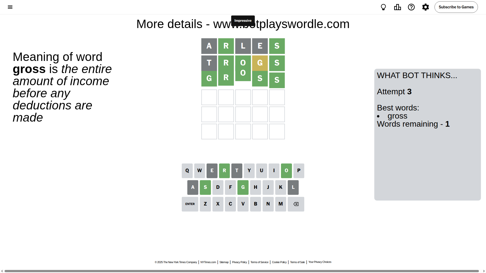

# Wordle for October 17, 2025 - \#1581

## Attempt 1

This is the first attempt and we'll choose a random word to start with.

Let's start with word `arles`

Attempt for `arles` gives us 2 correct letters, 0 present letters and 3 wrong letters.

If we look into details, we can see that:

Letter `a` is not present in the word and we will not use it any more

Letter `r` should be at position 2

Letter `l` is not present in the word and we will not use it any more

Letter `e` is not present in the word and we will not use it any more

Letter `s` should be at position 5

We got information about the correct letters and it should make next attempt easier

Some letters are missing (like `a`, `l`, `e`) but it's also important piece of information

Word should contain letters `[r s]`

That was a great guess that limited number of remaining words

## Attempt 2

Right now we have 15 words to choose from and best of them seem to be `[ornis trogs grits prius orris]`

So far we know that possible letters are:

At position 1: `[b c d f g h i j k m n o p q r s t u v w x y z]`

At position 2: `[r]`

At position 3: `[b c d f g h i j k m n o p q r s t u v w x y z]`

At position 4: `[b c d f g h i j k m n o p q r s t u v w x y z]`

At position 5: `[s]`

Next guess is `trogs`, let's see what it gives us

Attempt for `trogs` gives us 3 correct letters, 1 present letters and 1 wrong letters.

If we look into details, we can see that:

Letter `t` is not present in the word and we will not use it any more

Letter `o` should be at position 3

Letter `g` is on a different spot - this means that it cannot be at position 4

We got information about the correct letters and it should make next attempt easier

Some letters are missing (like `t`) but it's also important piece of information

Word should contain letters `[r s o g]`

That was a great guess that limited number of remaining words

## Attempt 3

Right now we have 1 words to choose from and best of them seem to be `[gross]`

So far we know that possible letters are:

At position 1: `[b c d f g h i j k m n o p q r s u v w x y z]`

At position 2: `[r]`

At position 3: `[o]`

At position 4: `[b c d f h i j k m n o p q r s u v w x y z]`

At position 5: `[s]`

It must be `gross`

That's the correct answer! The word is `gross`!

## Conclusion

Today's word is `gross` and it took 3 attempts to guess it

