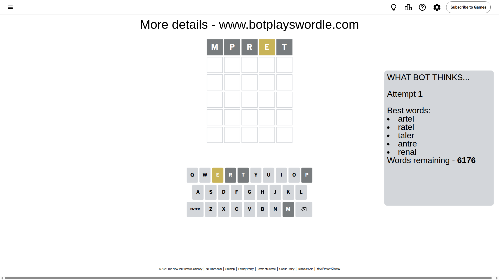
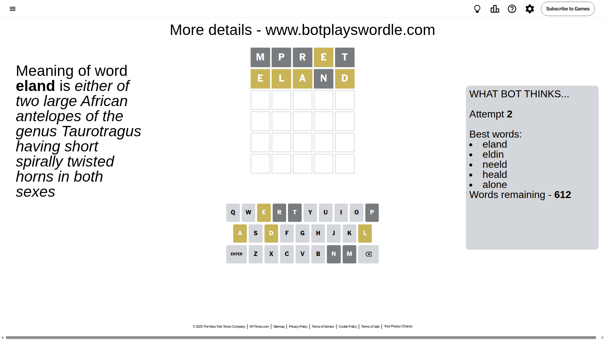
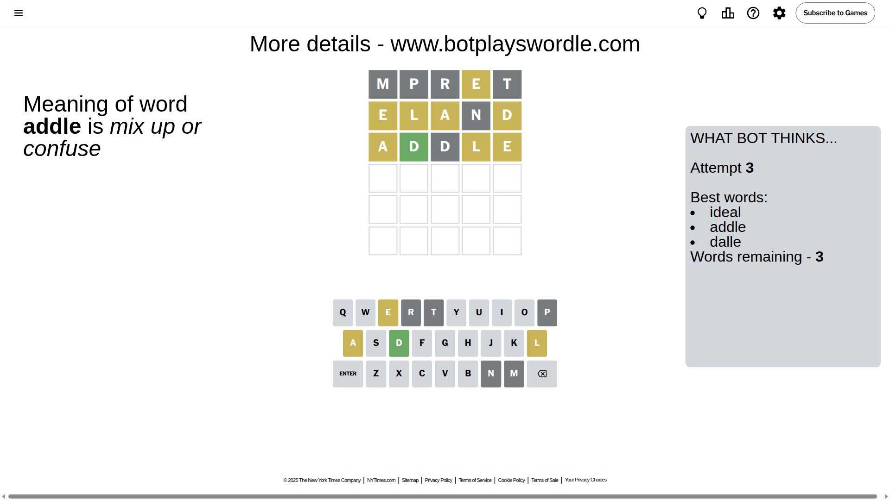
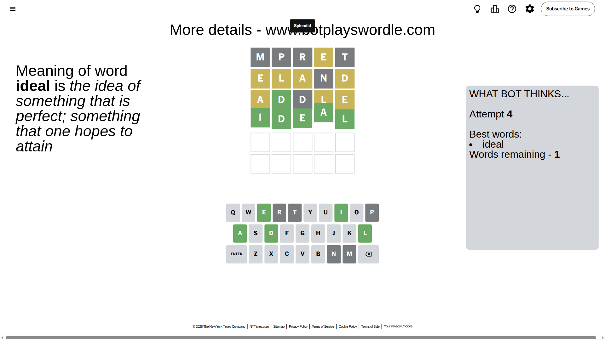

# Wordle for October 19, 2025 - \#1583

## Attempt 1

This is the first attempt and we'll choose a random word to start with.

Let's start with word `mpret`

Attempt for `mpret` gives us 0 correct letters, 1 present letters and 4 wrong letters.

If we look into details, we can see that:

Letter `m` is not present in the word and we will not use it any more

Letter `p` is not present in the word and we will not use it any more

Letter `r` is not present in the word and we will not use it any more

Letter `e` is on a different spot - this means that it cannot be at position 4

Letter `t` is not present in the word and we will not use it any more

Some letters are missing (like `m`, `p`, `r`, `t`) but it's also important piece of information

Word should contain letters `[e]`

That was a great guess that limited number of remaining words

## Attempt 2

Right now we have 612 words to choose from and best of them seem to be `[eland eldin neeld heald alone]`

So far we know that possible letters are:

At position 1: `[a b c d e f g h i j k l n o q s u v w x y z]`

At position 2: `[a b c d e f g h i j k l n o q s u v w x y z]`

At position 3: `[a b c d e f g h i j k l n o q s u v w x y z]`

At position 4: `[a b c d f g h i j k l n o q s u v w x y z]`

At position 5: `[a b c d e f g h i j k l n o q s u v w x y z]`

Next guess is `eland`, let's see what it gives us

Attempt for `eland` gives us 0 correct letters, 4 present letters and 1 wrong letters.

If we look into details, we can see that:

Letter `e` is on a different spot - this means that it cannot be at position 1

Letter `l` is on a different spot - this means that it cannot be at position 2

Letter `a` is on a different spot - this means that it cannot be at position 3

Letter `n` is not present in the word and we will not use it any more

Letter `d` is on a different spot - this means that it cannot be at position 5

Some letters are missing (like `n`) but it's also important piece of information

Word should contain letters `[e l a d]`

That was a great guess that limited number of remaining words

## Attempt 3

Right now we have 3 words to choose from and best of them seem to be `[ideal addle dalle]`

So far we know that possible letters are:

At position 1: `[a b c d f g h i j k l o q s u v w x y z]`

At position 2: `[a b c d e f g h i j k o q s u v w x y z]`

At position 3: `[b c d e f g h i j k l o q s u v w x y z]`

At position 4: `[a b c d f g h i j k l o q s u v w x y z]`

At position 5: `[a b c e f g h i j k l o q s u v w x y z]`

Next guess is `addle`, let's see what it gives us

Attempt for `addle` gives us 1 correct letters, 3 present letters and 1 wrong letters.

If we look into details, we can see that:

Letter `a` is on a different spot - this means that it cannot be at position 1

Letter `d` should be at position 2

Letter `d` is not present in the word and we will not use it any more

Letter `l` is on a different spot - this means that it cannot be at position 4

Letter `e` is on a different spot - this means that it cannot be at position 5

We got information about the correct letters and it should make next attempt easier

Some letters are missing (like `d`) but it's also important piece of information

Word should contain letters `[e l a d]`

Could be a better guess

## Attempt 4

Right now we have 1 words to choose from and best of them seem to be `[ideal]`

So far we know that possible letters are:

At position 1: `[b c f g h i j k l o q s u v w x y z]`

At position 2: `[d]`

At position 3: `[b c e f g h i j k l o q s u v w x y z]`

At position 4: `[a b c f g h i j k o q s u v w x y z]`

At position 5: `[a b c f g h i j k l o q s u v w x y z]`

It must be `ideal`

That's the correct answer! The word is `ideal`!

## Conclusion

Today's word is `ideal` and it took 4 attempts to guess it

