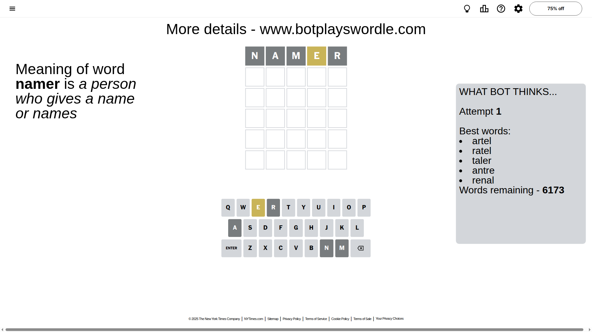
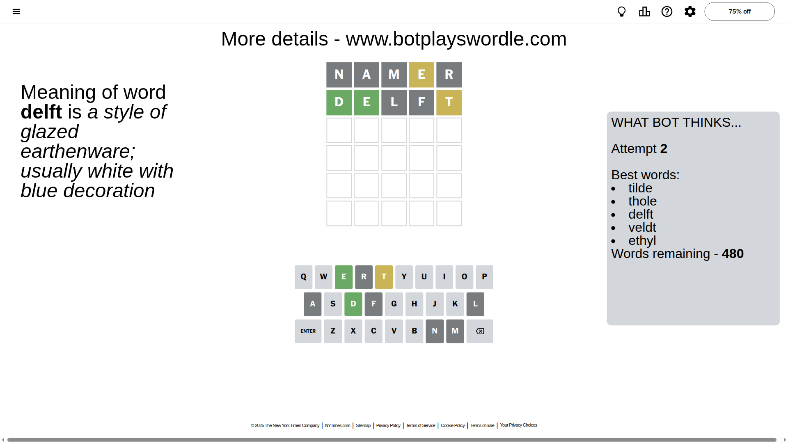
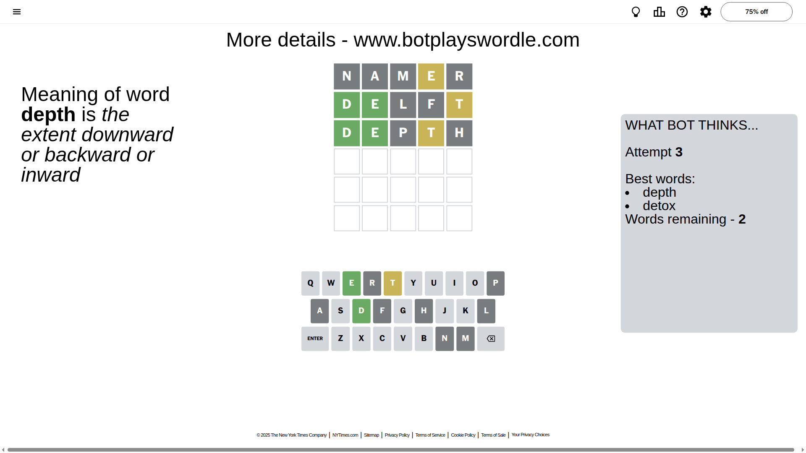
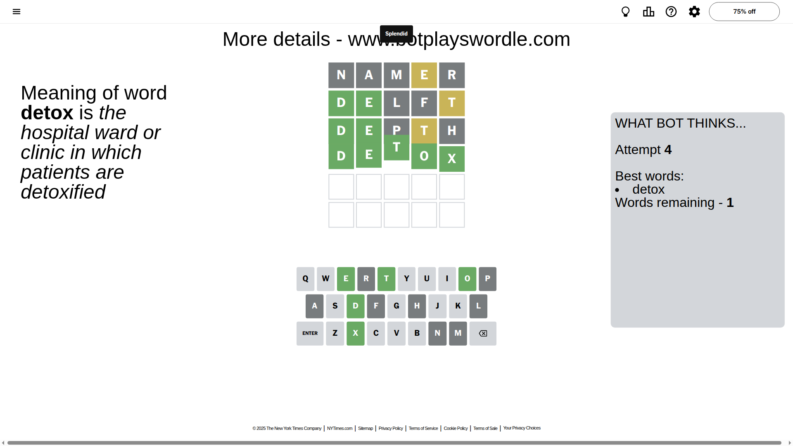

# Wordle for October 21, 2025 - \#1585

## Attempt 1

This is the first attempt and we'll choose a random word to start with.

Let's start with word `namer`

Attempt for `namer` gives us 0 correct letters, 1 present letters and 4 wrong letters.

If we look into details, we can see that:

Letter `n` is not present in the word and we will not use it any more

Letter `a` is not present in the word and we will not use it any more

Letter `m` is not present in the word and we will not use it any more

Letter `e` is on a different spot - this means that it cannot be at position 4

Letter `r` is not present in the word and we will not use it any more

Some letters are missing (like `n`, `a`, `m`, `r`) but it's also important piece of information

Word should contain letters `[e]`

That was a great guess that limited number of remaining words

## Attempt 2

Right now we have 480 words to choose from and best of them seem to be `[tilde thole delft veldt ethyl]`

So far we know that possible letters are:

At position 1: `[b c d e f g h i j k l o p q s t u v w x y z]`

At position 2: `[b c d e f g h i j k l o p q s t u v w x y z]`

At position 3: `[b c d e f g h i j k l o p q s t u v w x y z]`

At position 4: `[b c d f g h i j k l o p q s t u v w x y z]`

At position 5: `[b c d e f g h i j k l o p q s t u v w x y z]`

Next guess is `delft`, let's see what it gives us

Attempt for `delft` gives us 2 correct letters, 1 present letters and 2 wrong letters.

If we look into details, we can see that:

Letter `d` should be at position 1

Letter `e` should be at position 2

Letter `l` is not present in the word and we will not use it any more

Letter `f` is not present in the word and we will not use it any more

Letter `t` is on a different spot - this means that it cannot be at position 5

We got information about the correct letters and it should make next attempt easier

Some letters are missing (like `l`, `f`) but it's also important piece of information

Word should contain letters `[e d t]`

That was a great guess that limited number of remaining words

## Attempt 3

Right now we have 2 words to choose from and best of them seem to be `[depth detox]`

So far we know that possible letters are:

At position 1: `[d]`

At position 2: `[e]`

At position 3: `[b c d e g h i j k o p q s t u v w x y z]`

At position 4: `[b c d g h i j k o p q s t u v w x y z]`

At position 5: `[b c d e g h i j k o p q s u v w x y z]`

Next guess is `depth`, let's see what it gives us

Attempt for `depth` gives us 2 correct letters, 1 present letters and 2 wrong letters.

If we look into details, we can see that:

Letter `p` is not present in the word and we will not use it any more

Letter `t` is on a different spot - this means that it cannot be at position 4

Letter `h` is not present in the word and we will not use it any more

Some letters are missing (like `p`, `h`) but it's also important piece of information

Word should contain letters `[e d t]`

This was a waste, almost no valuable information...

## Attempt 4

Right now we have 1 words to choose from and best of them seem to be `[detox]`

So far we know that possible letters are:

At position 1: `[d]`

At position 2: `[e]`

At position 3: `[b c d e g i j k o q s t u v w x y z]`

At position 4: `[b c d g i j k o q s u v w x y z]`

At position 5: `[b c d e g i j k o q s u v w x y z]`

It must be `detox`

That's the correct answer! The word is `detox`!

## Conclusion

Today's word is `detox` and it took 4 attempts to guess it

