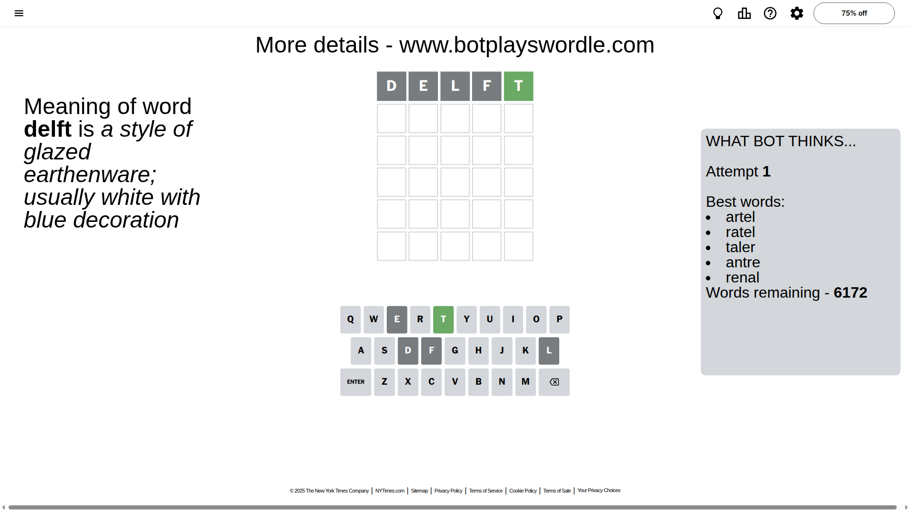
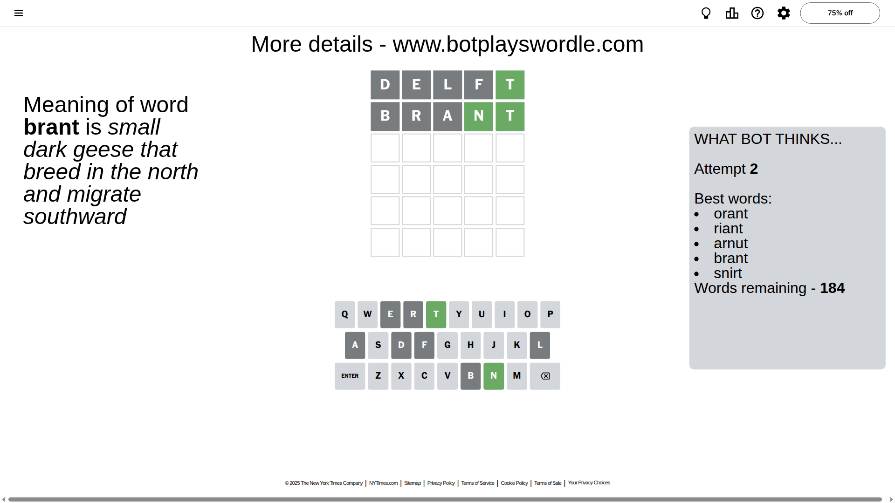
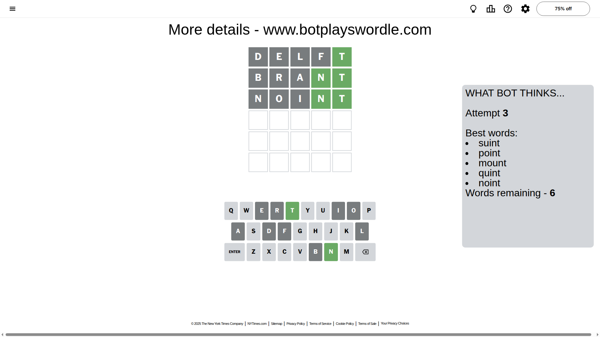
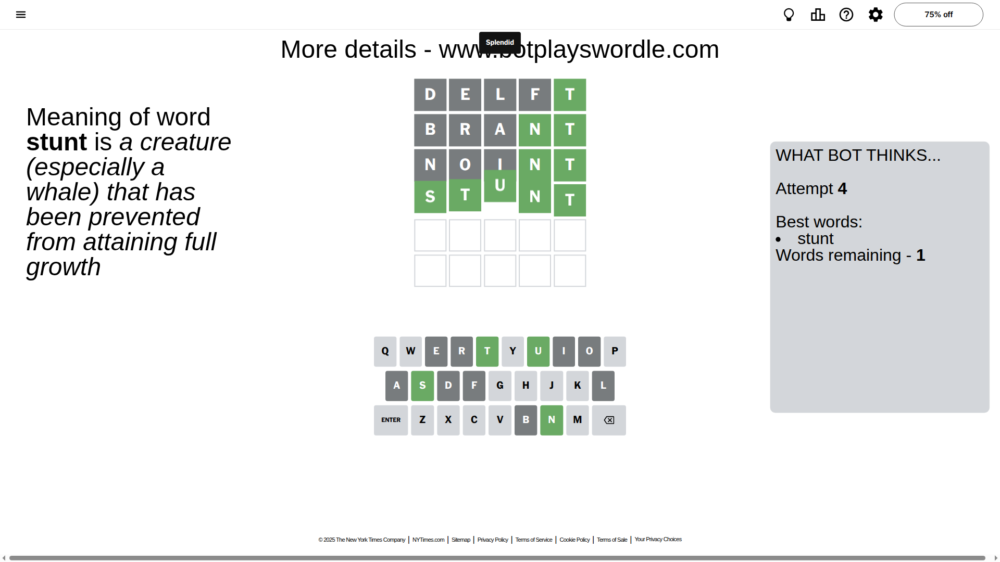

# Wordle for October 22, 2025 - \#1586

## Attempt 1

This is the first attempt and we'll choose a random word to start with.

Let's start with word `delft`

Attempt for `delft` gives us 1 correct letters, 0 present letters and 4 wrong letters.

If we look into details, we can see that:

Letter `d` is not present in the word and we will not use it any more

Letter `e` is not present in the word and we will not use it any more

Letter `l` is not present in the word and we will not use it any more

Letter `f` is not present in the word and we will not use it any more

Letter `t` should be at position 5

We got information about the correct letters and it should make next attempt easier

Some letters are missing (like `d`, `e`, `l`, `f`) but it's also important piece of information

Word should contain letters `[t]`

That was a great guess that limited number of remaining words

## Attempt 2

Right now we have 184 words to choose from and best of them seem to be `[orant riant arnut brant snirt]`

So far we know that possible letters are:

At position 1: `[a b c g h i j k m n o p q r s t u v w x y z]`

At position 2: `[a b c g h i j k m n o p q r s t u v w x y z]`

At position 3: `[a b c g h i j k m n o p q r s t u v w x y z]`

At position 4: `[a b c g h i j k m n o p q r s t u v w x y z]`

At position 5: `[t]`

Next guess is `brant`, let's see what it gives us

Attempt for `brant` gives us 2 correct letters, 0 present letters and 3 wrong letters.

If we look into details, we can see that:

Letter `b` is not present in the word and we will not use it any more

Letter `r` is not present in the word and we will not use it any more

Letter `a` is not present in the word and we will not use it any more

Letter `n` should be at position 4

We got information about the correct letters and it should make next attempt easier

Some letters are missing (like `b`, `r`, `a`) but it's also important piece of information

Word should contain letters `[t n]`

That was a great guess that limited number of remaining words

## Attempt 3

Right now we have 6 words to choose from and best of them seem to be `[suint point mount quint noint]`

So far we know that possible letters are:

At position 1: `[c g h i j k m n o p q s t u v w x y z]`

At position 2: `[c g h i j k m n o p q s t u v w x y z]`

At position 3: `[c g h i j k m n o p q s t u v w x y z]`

At position 4: `[n]`

At position 5: `[t]`

Next guess is `noint`, let's see what it gives us

Attempt for `noint` gives us 2 correct letters, 0 present letters and 3 wrong letters.

If we look into details, we can see that:

Letter `n` is not present in the word and we will not use it any more

Letter `o` is not present in the word and we will not use it any more

Letter `i` is not present in the word and we will not use it any more

Some letters are missing (like `n`, `o`, `i`) but it's also important piece of information

Word should contain letters `[t n]`

Not a bad guess in general

## Attempt 4

Right now we have 1 words to choose from and best of them seem to be `[stunt]`

So far we know that possible letters are:

At position 1: `[c g h j k m p q s t u v w x y z]`

At position 2: `[c g h j k m p q s t u v w x y z]`

At position 3: `[c g h j k m p q s t u v w x y z]`

At position 4: `[n]`

At position 5: `[t]`

It must be `stunt`

That's the correct answer! The word is `stunt`!

## Conclusion

Today's word is `stunt` and it took 4 attempts to guess it

