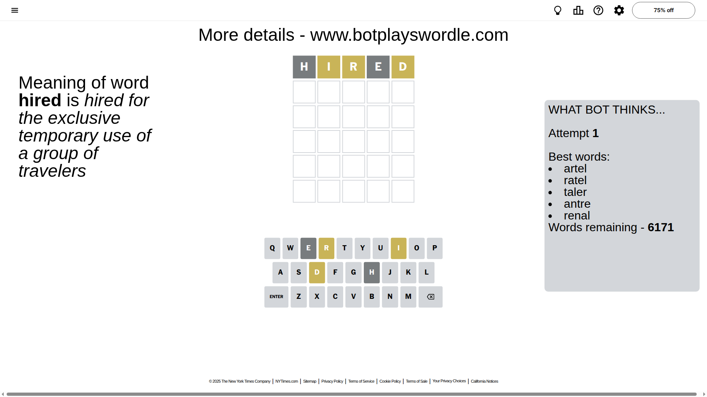
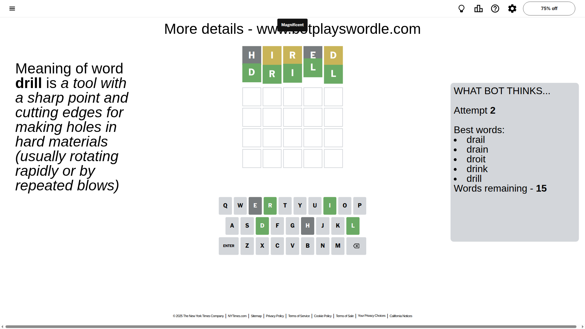

# Wordle for October 23, 2025 - \#1587

## Attempt 1

This is the first attempt and we'll choose a random word to start with.

Let's start with word `hired`

Attempt for `hired` gives us 0 correct letters, 3 present letters and 2 wrong letters.

If we look into details, we can see that:

Letter `h` is not present in the word and we will not use it any more

Letter `i` is on a different spot - this means that it cannot be at position 2

Letter `r` is on a different spot - this means that it cannot be at position 3

Letter `e` is not present in the word and we will not use it any more

Letter `d` is on a different spot - this means that it cannot be at position 5

Some letters are missing (like `h`, `e`) but it's also important piece of information

Word should contain letters `[i r d]`

That was a great guess that limited number of remaining words

## Attempt 2

Right now we have 15 words to choose from and best of them seem to be `[drail drain droit drink drill]`

So far we know that possible letters are:

At position 1: `[a b c d f g i j k l m n o p q r s t u v w x y z]`

At position 2: `[a b c d f g j k l m n o p q r s t u v w x y z]`

At position 3: `[a b c d f g i j k l m n o p q s t u v w x y z]`

At position 4: `[a b c d f g i j k l m n o p q r s t u v w x y z]`

At position 5: `[a b c f g i j k l m n o p q r s t u v w x y z]`

Next guess is `drill`, let's see what it gives us

That's the correct answer! The word is `drill`!

To be honest that was a pretty lucky guess, but it worked out well.

## Conclusion

Today's word is `drill` and it took 2 attempts to guess it

