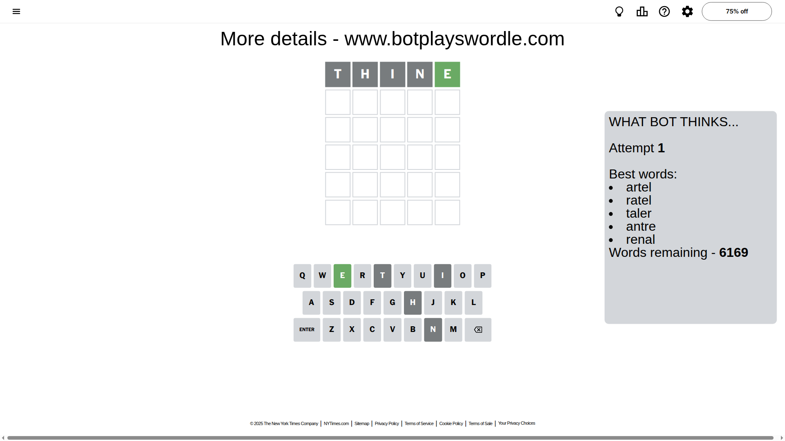
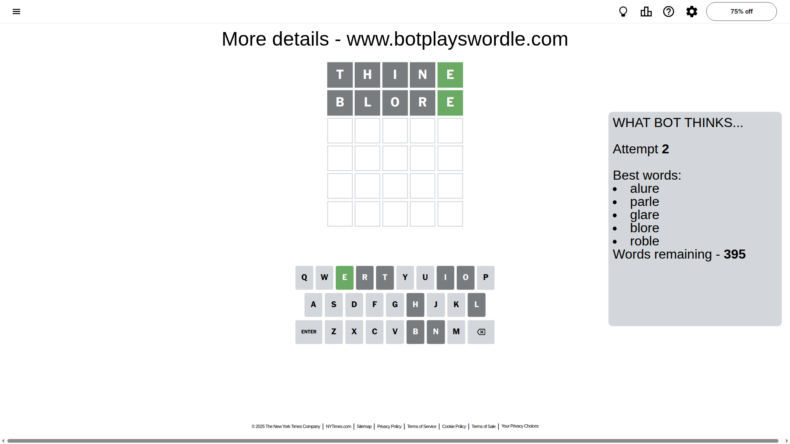
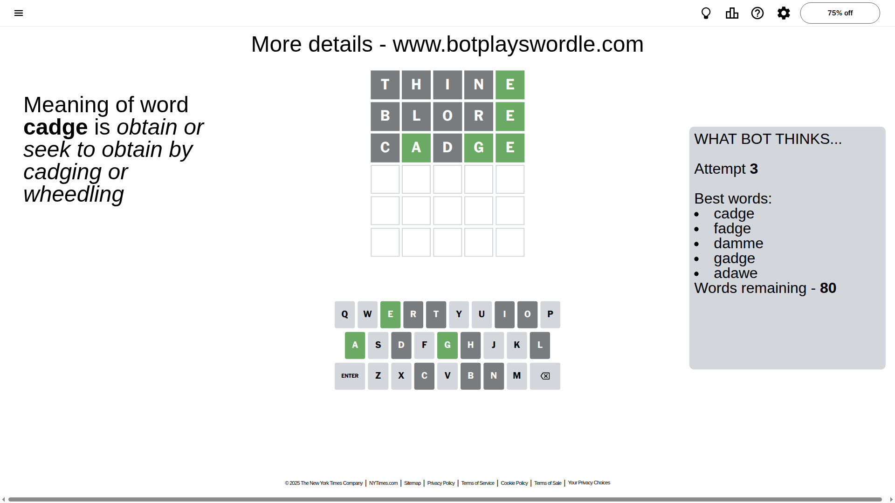
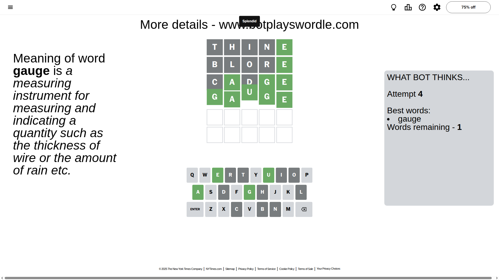

# Wordle for October 25, 2025 - \#1589

## Attempt 1

This is the first attempt and we'll choose a random word to start with.

Let's start with word `thine`

Attempt for `thine` gives us 1 correct letters, 0 present letters and 4 wrong letters.

If we look into details, we can see that:

Letter `t` is not present in the word and we will not use it any more

Letter `h` is not present in the word and we will not use it any more

Letter `i` is not present in the word and we will not use it any more

Letter `n` is not present in the word and we will not use it any more

Letter `e` should be at position 5

We got information about the correct letters and it should make next attempt easier

Some letters are missing (like `t`, `h`, `i`, `n`) but it's also important piece of information

Word should contain letters `[e]`

That was a great guess that limited number of remaining words

## Attempt 2

Right now we have 395 words to choose from and best of them seem to be `[alure parle glare blore roble]`

So far we know that possible letters are:

At position 1: `[a b c d e f g j k l m o p q r s u v w x y z]`

At position 2: `[a b c d e f g j k l m o p q r s u v w x y z]`

At position 3: `[a b c d e f g j k l m o p q r s u v w x y z]`

At position 4: `[a b c d e f g j k l m o p q r s u v w x y z]`

At position 5: `[e]`

Next guess is `blore`, let's see what it gives us

Attempt for `blore` gives us 1 correct letters, 0 present letters and 4 wrong letters.

If we look into details, we can see that:

Letter `b` is not present in the word and we will not use it any more

Letter `l` is not present in the word and we will not use it any more

Letter `o` is not present in the word and we will not use it any more

Letter `r` is not present in the word and we will not use it any more

Some letters are missing (like `b`, `l`, `o`, `r`) but it's also important piece of information

Word should contain letters `[e]`

Not a bad guess in general

## Attempt 3

Right now we have 80 words to choose from and best of them seem to be `[cadge fadge damme gadge adawe]`

So far we know that possible letters are:

At position 1: `[a c d e f g j k m p q s u v w x y z]`

At position 2: `[a c d e f g j k m p q s u v w x y z]`

At position 3: `[a c d e f g j k m p q s u v w x y z]`

At position 4: `[a c d e f g j k m p q s u v w x y z]`

At position 5: `[e]`

Next guess is `cadge`, let's see what it gives us

Attempt for `cadge` gives us 3 correct letters, 0 present letters and 2 wrong letters.

If we look into details, we can see that:

Letter `c` is not present in the word and we will not use it any more

Letter `a` should be at position 2

Letter `d` is not present in the word and we will not use it any more

Letter `g` should be at position 4

We got information about the correct letters and it should make next attempt easier

Some letters are missing (like `c`, `d`) but it's also important piece of information

Word should contain letters `[e a g]`

That was a great guess that limited number of remaining words

## Attempt 4

Right now we have 1 words to choose from and best of them seem to be `[gauge]`

So far we know that possible letters are:

At position 1: `[a e f g j k m p q s u v w x y z]`

At position 2: `[a]`

At position 3: `[a e f g j k m p q s u v w x y z]`

At position 4: `[g]`

At position 5: `[e]`

It must be `gauge`

That's the correct answer! The word is `gauge`!

## Conclusion

Today's word is `gauge` and it took 4 attempts to guess it

