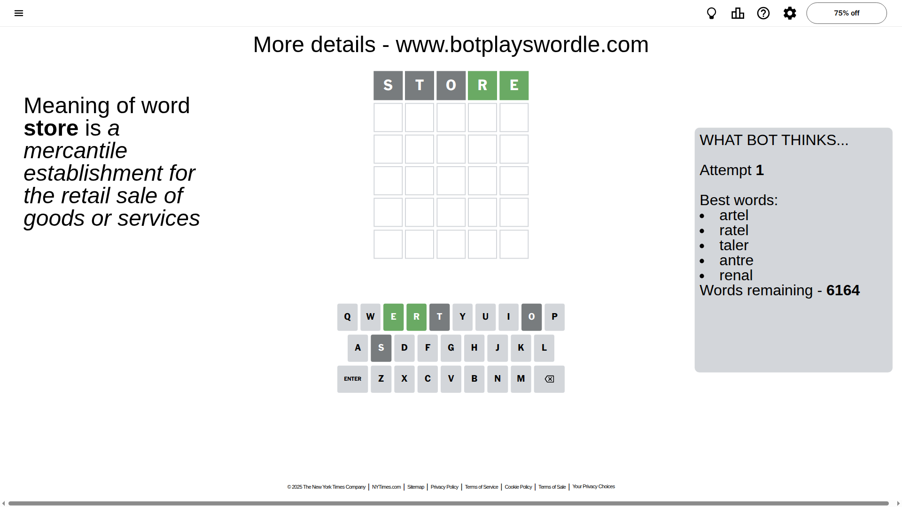

# Wordle for October 29, 2025 - \#1593

## Attempt 1

This is the first attempt and we'll choose a random word to start with.

Let's start with word `store`

Attempt for `store` gives us 2 correct letters, 0 present letters and 3 wrong letters.

If we look into details, we can see that:

Letter `s` is not present in the word and we will not use it any more

Letter `t` is not present in the word and we will not use it any more

Letter `o` is not present in the word and we will not use it any more

Letter `r` should be at position 4

Letter `e` should be at position 5

We got information about the correct letters and it should make next attempt easier

Some letters are missing (like `s`, `t`, `o`) but it's also important piece of information

Word should contain letters `[r e]`

That was a great guess that limited number of remaining words

## Attempt 2

Right now we have 26 words to choose from and best of them seem to be `[alure glare nacre inure lucre]`

So far we know that possible letters are:

At position 1: `[a b c d e f g h i j k l m n p q r u v w x y z]`

At position 2: `[a b c d e f g h i j k l m n p q r u v w x y z]`

At position 3: `[a b c d e f g h i j k l m n p q r u v w x y z]`

At position 4: `[r]`

At position 5: `[e]`

Next guess is `glare`, let's see what it gives us

That's the correct answer! The word is `glare`!

To be honest that was a pretty lucky guess, but it worked out well.

## Conclusion

Today's word is `glare` and it took 2 attempts to guess it

