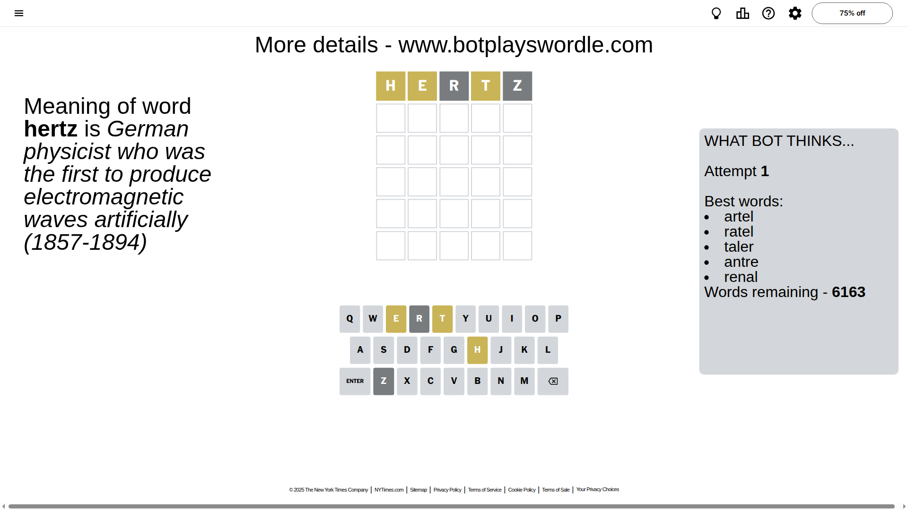
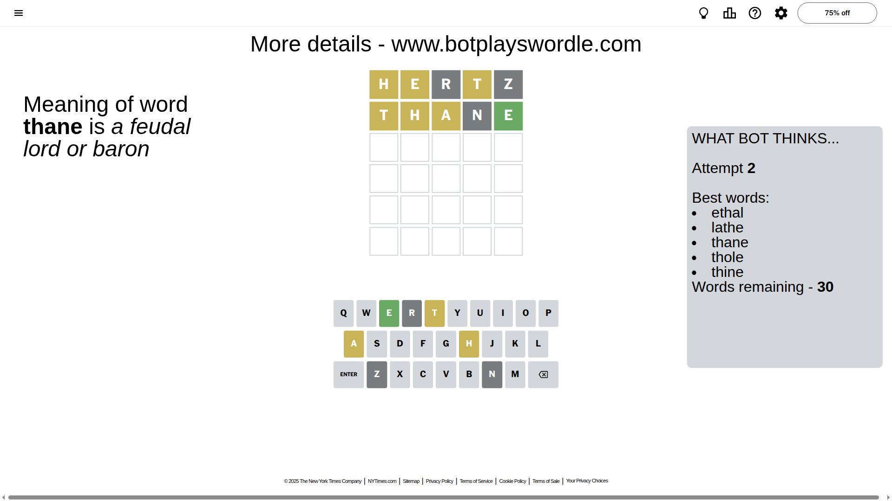
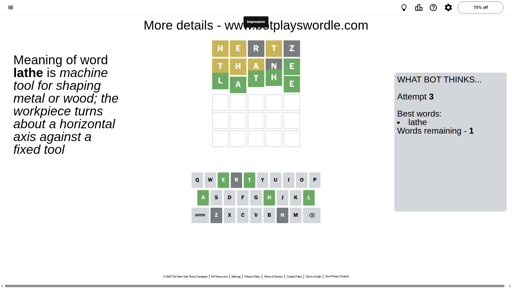

# Wordle for October 30, 2025 - \#1594

## Attempt 1

This is the first attempt and we'll choose a random word to start with.

Let's start with word `hertz`

Attempt for `hertz` gives us 0 correct letters, 3 present letters and 2 wrong letters.

If we look into details, we can see that:

Letter `h` is on a different spot - this means that it cannot be at position 1

Letter `e` is on a different spot - this means that it cannot be at position 2

Letter `r` is not present in the word and we will not use it any more

Letter `t` is on a different spot - this means that it cannot be at position 4

Letter `z` is not present in the word and we will not use it any more

Some letters are missing (like `r`, `z`) but it's also important piece of information

Word should contain letters `[h e t]`

That was a great guess that limited number of remaining words

## Attempt 2

Right now we have 30 words to choose from and best of them seem to be `[ethal lathe thane thole thine]`

So far we know that possible letters are:

At position 1: `[a b c d e f g i j k l m n o p q s t u v w x y]`

At position 2: `[a b c d f g h i j k l m n o p q s t u v w x y]`

At position 3: `[a b c d e f g h i j k l m n o p q s t u v w x y]`

At position 4: `[a b c d e f g h i j k l m n o p q s u v w x y]`

At position 5: `[a b c d e f g h i j k l m n o p q s t u v w x y]`

Next guess is `thane`, let's see what it gives us

Attempt for `thane` gives us 1 correct letters, 3 present letters and 1 wrong letters.

If we look into details, we can see that:

Letter `t` is on a different spot - this means that it cannot be at position 1

Letter `h` is on a different spot - this means that it cannot be at position 2

Letter `a` is on a different spot - this means that it cannot be at position 3

Letter `n` is not present in the word and we will not use it any more

Letter `e` should be at position 5

We got information about the correct letters and it should make next attempt easier

Some letters are missing (like `n`) but it's also important piece of information

Word should contain letters `[h e t a]`

That was a great guess that limited number of remaining words

## Attempt 3

Right now we have 1 words to choose from and best of them seem to be `[lathe]`

So far we know that possible letters are:

At position 1: `[a b c d e f g i j k l m o p q s u v w x y]`

At position 2: `[a b c d f g i j k l m o p q s t u v w x y]`

At position 3: `[b c d e f g h i j k l m o p q s t u v w x y]`

At position 4: `[a b c d e f g h i j k l m o p q s u v w x y]`

At position 5: `[e]`

It must be `lathe`

That's the correct answer! The word is `lathe`!

## Conclusion

Today's word is `lathe` and it took 3 attempts to guess it

