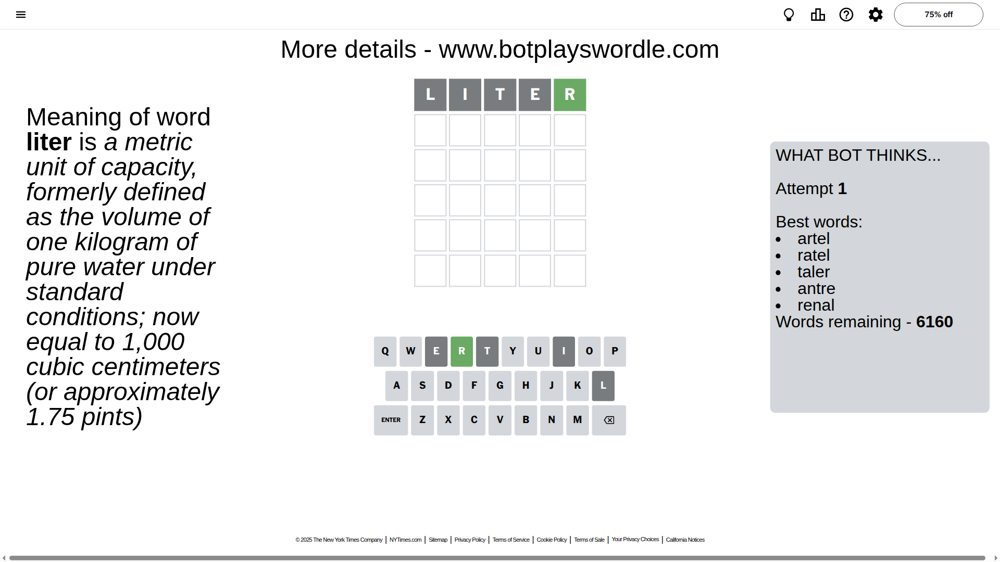
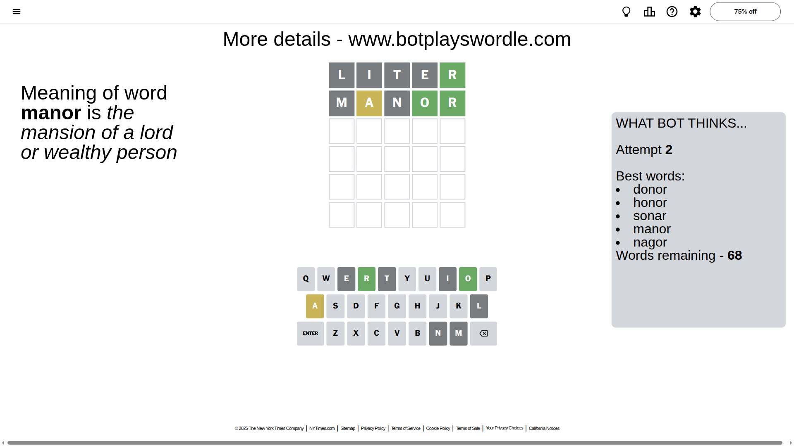
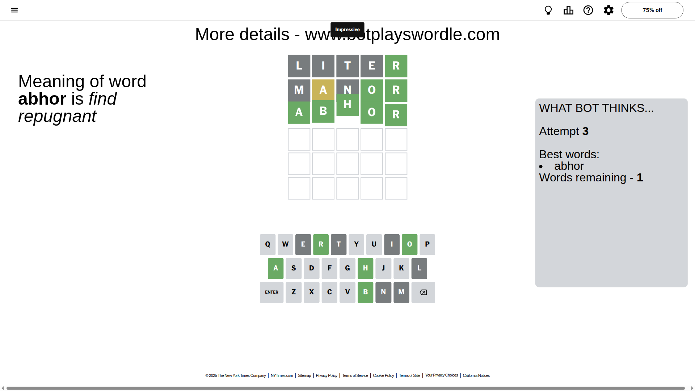

# Wordle for October 31, 2025 - \#1595

## Attempt 1

This is the first attempt and we'll choose a random word to start with.

Let's start with word `liter`

Attempt for `liter` gives us 1 correct letters, 0 present letters and 4 wrong letters.

If we look into details, we can see that:

Letter `l` is not present in the word and we will not use it any more

Letter `i` is not present in the word and we will not use it any more

Letter `t` is not present in the word and we will not use it any more

Letter `e` is not present in the word and we will not use it any more

Letter `r` should be at position 5

We got information about the correct letters and it should make next attempt easier

Some letters are missing (like `l`, `i`, `t`, `e`) but it's also important piece of information

Word should contain letters `[r]`

That was a great guess that limited number of remaining words

## Attempt 2

Right now we have 68 words to choose from and best of them seem to be `[donor honor sonar manor nagor]`

So far we know that possible letters are:

At position 1: `[a b c d f g h j k m n o p q r s u v w x y z]`

At position 2: `[a b c d f g h j k m n o p q r s u v w x y z]`

At position 3: `[a b c d f g h j k m n o p q r s u v w x y z]`

At position 4: `[a b c d f g h j k m n o p q r s u v w x y z]`

At position 5: `[r]`

Next guess is `manor`, let's see what it gives us

Attempt for `manor` gives us 2 correct letters, 1 present letters and 2 wrong letters.

If we look into details, we can see that:

Letter `m` is not present in the word and we will not use it any more

Letter `a` is on a different spot - this means that it cannot be at position 2

Letter `n` is not present in the word and we will not use it any more

Letter `o` should be at position 4

We got information about the correct letters and it should make next attempt easier

Some letters are missing (like `m`, `n`) but it's also important piece of information

Word should contain letters `[r a o]`

That was a great guess that limited number of remaining words

## Attempt 3

Right now we have 1 words to choose from and best of them seem to be `[abhor]`

So far we know that possible letters are:

At position 1: `[a b c d f g h j k o p q r s u v w x y z]`

At position 2: `[b c d f g h j k o p q r s u v w x y z]`

At position 3: `[a b c d f g h j k o p q r s u v w x y z]`

At position 4: `[o]`

At position 5: `[r]`

It must be `abhor`

That's the correct answer! The word is `abhor`!

## Conclusion

Today's word is `abhor` and it took 3 attempts to guess it

