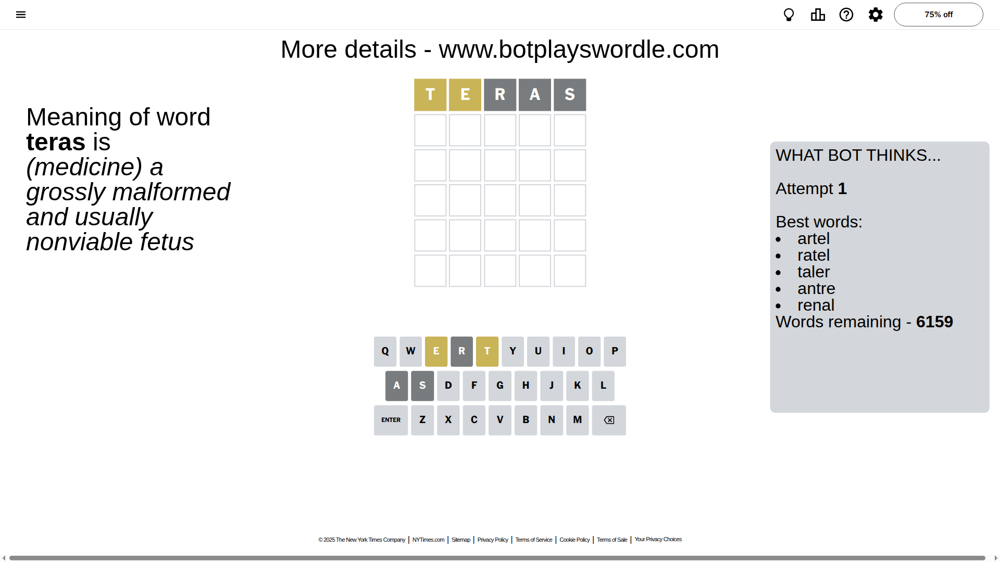
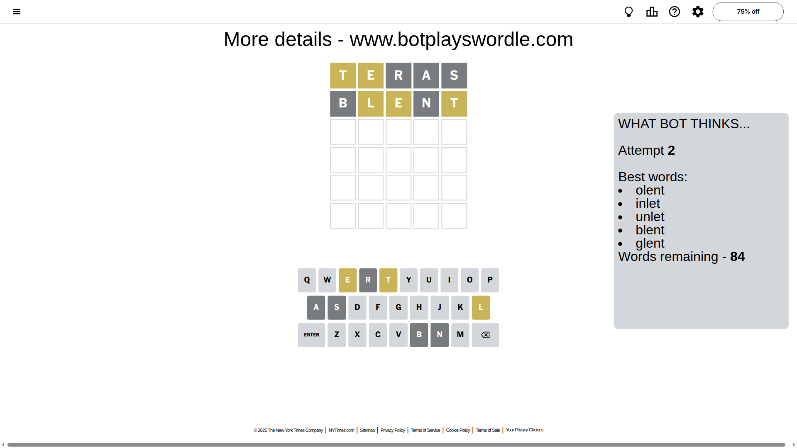
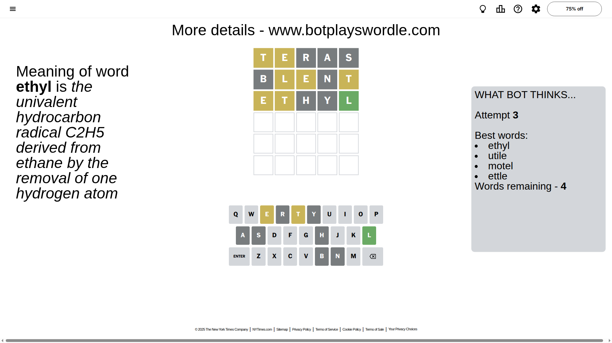
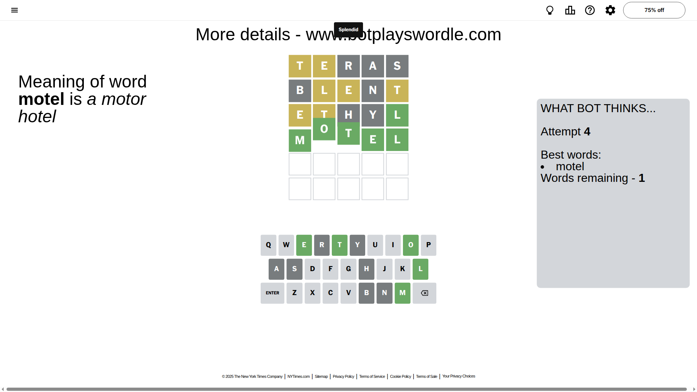

# Wordle for November 1, 2025 - \#1596

## Attempt 1

This is the first attempt and we'll choose a random word to start with.

Let's start with word `teras`

Attempt for `teras` gives us 0 correct letters, 2 present letters and 3 wrong letters.

If we look into details, we can see that:

Letter `t` is on a different spot - this means that it cannot be at position 1

Letter `e` is on a different spot - this means that it cannot be at position 2

Letter `r` is not present in the word and we will not use it any more

Letter `a` is not present in the word and we will not use it any more

Letter `s` is not present in the word and we will not use it any more

Some letters are missing (like `r`, `a`, `s`) but it's also important piece of information

Word should contain letters `[t e]`

That was a great guess that limited number of remaining words

## Attempt 2

Right now we have 84 words to choose from and best of them seem to be `[olent inlet unlet blent glent]`

So far we know that possible letters are:

At position 1: `[b c d e f g h i j k l m n o p q u v w x y z]`

At position 2: `[b c d f g h i j k l m n o p q t u v w x y z]`

At position 3: `[b c d e f g h i j k l m n o p q t u v w x y z]`

At position 4: `[b c d e f g h i j k l m n o p q t u v w x y z]`

At position 5: `[b c d e f g h i j k l m n o p q t u v w x y z]`

Next guess is `blent`, let's see what it gives us

Attempt for `blent` gives us 0 correct letters, 3 present letters and 2 wrong letters.

If we look into details, we can see that:

Letter `b` is not present in the word and we will not use it any more

Letter `l` is on a different spot - this means that it cannot be at position 2

Letter `e` is on a different spot - this means that it cannot be at position 3

Letter `n` is not present in the word and we will not use it any more

Letter `t` is on a different spot - this means that it cannot be at position 5

Some letters are missing (like `b`, `n`) but it's also important piece of information

Word should contain letters `[t e l]`

That was a great guess that limited number of remaining words

## Attempt 3

Right now we have 4 words to choose from and best of them seem to be `[ethyl utile motel ettle]`

So far we know that possible letters are:

At position 1: `[c d e f g h i j k l m o p q u v w x y z]`

At position 2: `[c d f g h i j k m o p q t u v w x y z]`

At position 3: `[c d f g h i j k l m o p q t u v w x y z]`

At position 4: `[c d e f g h i j k l m o p q t u v w x y z]`

At position 5: `[c d e f g h i j k l m o p q u v w x y z]`

Next guess is `ethyl`, let's see what it gives us

Attempt for `ethyl` gives us 1 correct letters, 2 present letters and 2 wrong letters.

If we look into details, we can see that:

Letter `e` is on a different spot - this means that it cannot be at position 1

Letter `t` is on a different spot - this means that it cannot be at position 2

Letter `h` is not present in the word and we will not use it any more

Letter `y` is not present in the word and we will not use it any more

Letter `l` should be at position 5

We got information about the correct letters and it should make next attempt easier

Some letters are missing (like `h`, `y`) but it's also important piece of information

Word should contain letters `[t e l]`

Could be a better guess

## Attempt 4

Right now we have 1 words to choose from and best of them seem to be `[motel]`

So far we know that possible letters are:

At position 1: `[c d f g i j k l m o p q u v w x z]`

At position 2: `[c d f g i j k m o p q u v w x z]`

At position 3: `[c d f g i j k l m o p q t u v w x z]`

At position 4: `[c d e f g i j k l m o p q t u v w x z]`

At position 5: `[l]`

It must be `motel`

That's the correct answer! The word is `motel`!

## Conclusion

Today's word is `motel` and it took 4 attempts to guess it

