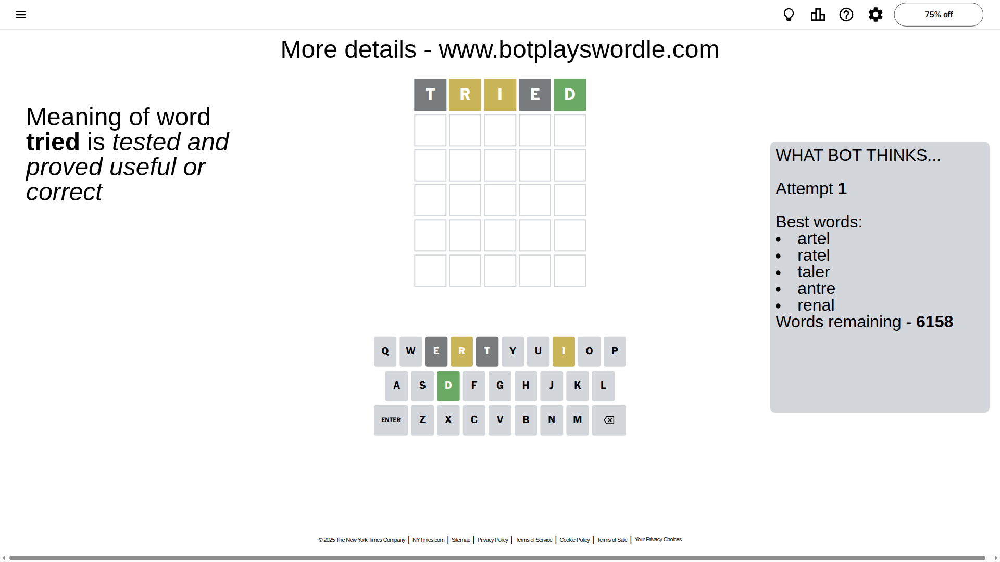
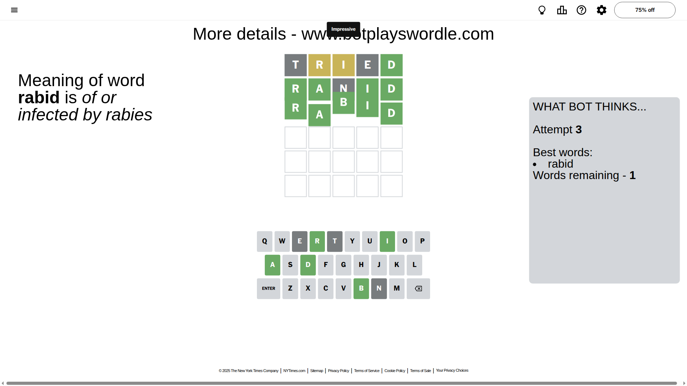

# Wordle for November 2, 2025 - \#1597

## Attempt 1

This is the first attempt and we'll choose a random word to start with.

Let's start with word `tried`

Attempt for `tried` gives us 1 correct letters, 2 present letters and 2 wrong letters.

If we look into details, we can see that:

Letter `t` is not present in the word and we will not use it any more

Letter `r` is on a different spot - this means that it cannot be at position 2

Letter `i` is on a different spot - this means that it cannot be at position 3

Letter `e` is not present in the word and we will not use it any more

Letter `d` should be at position 5

We got information about the correct letters and it should make next attempt easier

Some letters are missing (like `t`, `e`) but it's also important piece of information

Word should contain letters `[r i d]`

That was a great guess that limited number of remaining words

## Attempt 2

Right now we have 12 words to choose from and best of them seem to be `[liard ranid lurid unrid marid]`

So far we know that possible letters are:

At position 1: `[a b c d f g h i j k l m n o p q r s u v w x y z]`

At position 2: `[a b c d f g h i j k l m n o p q s u v w x y z]`

At position 3: `[a b c d f g h j k l m n o p q r s u v w x y z]`

At position 4: `[a b c d f g h i j k l m n o p q r s u v w x y z]`

At position 5: `[d]`

Next guess is `ranid`, let's see what it gives us

Attempt for `ranid` gives us 4 correct letters, 0 present letters and 1 wrong letters.

If we look into details, we can see that:

Letter `r` should be at position 1

Letter `a` should be at position 2

Letter `n` is not present in the word and we will not use it any more

Letter `i` should be at position 4

We got information about the correct letters and it should make next attempt easier

Some letters are missing (like `n`) but it's also important piece of information

Word should contain letters `[r i d a]`

That was a great guess that limited number of remaining words

## Attempt 3

Right now we have 1 words to choose from and best of them seem to be `[rabid]`

So far we know that possible letters are:

At position 1: `[r]`

At position 2: `[a]`

At position 3: `[a b c d f g h j k l m o p q r s u v w x y z]`

At position 4: `[i]`

At position 5: `[d]`

It must be `rabid`

That's the correct answer! The word is `rabid`!

## Conclusion

Today's word is `rabid` and it took 3 attempts to guess it

