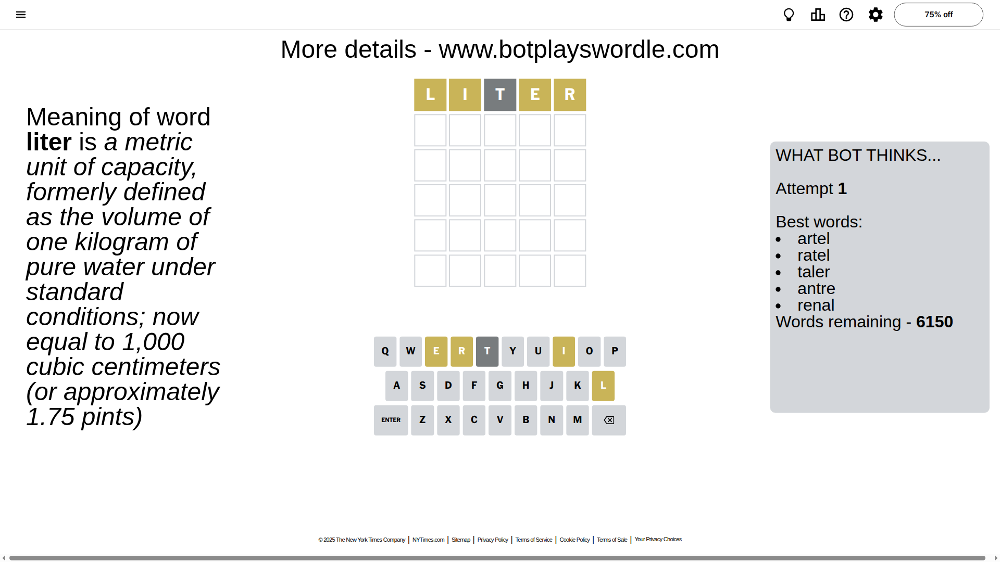
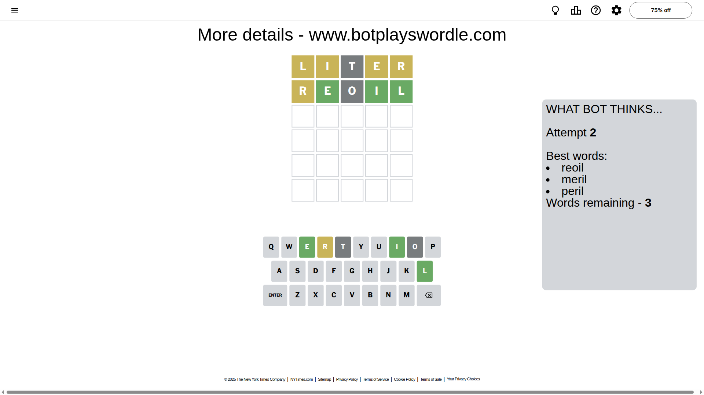
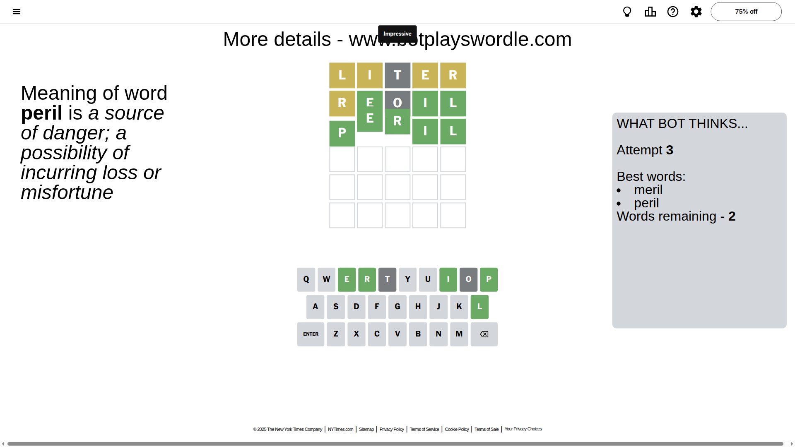

# Wordle for November 7, 2025 - \#1602

## Attempt 1

This is the first attempt and we'll choose a random word to start with.

Let's start with word `liter`

Attempt for `liter` gives us 0 correct letters, 4 present letters and 1 wrong letters.

If we look into details, we can see that:

Letter `l` is on a different spot - this means that it cannot be at position 1

Letter `i` is on a different spot - this means that it cannot be at position 2

Letter `t` is not present in the word and we will not use it any more

Letter `e` is on a different spot - this means that it cannot be at position 4

Letter `r` is on a different spot - this means that it cannot be at position 5

Some letters are missing (like `t`) but it's also important piece of information

Word should contain letters `[l i e r]`

That was a great guess that limited number of remaining words

## Attempt 2

Right now we have 3 words to choose from and best of them seem to be `[reoil meril peril]`

So far we know that possible letters are:

At position 1: `[a b c d e f g h i j k m n o p q r s u v w x y z]`

At position 2: `[a b c d e f g h j k l m n o p q r s u v w x y z]`

At position 3: `[a b c d e f g h i j k l m n o p q r s u v w x y z]`

At position 4: `[a b c d f g h i j k l m n o p q r s u v w x y z]`

At position 5: `[a b c d e f g h i j k l m n o p q s u v w x y z]`

Next guess is `reoil`, let's see what it gives us

Attempt for `reoil` gives us 3 correct letters, 1 present letters and 1 wrong letters.

If we look into details, we can see that:

Letter `r` is on a different spot - this means that it cannot be at position 1

Letter `e` should be at position 2

Letter `o` is not present in the word and we will not use it any more

Letter `i` should be at position 4

Letter `l` should be at position 5

We got information about the correct letters and it should make next attempt easier

Some letters are missing (like `o`) but it's also important piece of information

Word should contain letters `[l i e r]`

This was a waste, almost no valuable information...

## Attempt 3

Right now we have 2 words to choose from and best of them seem to be `[meril peril]`

So far we know that possible letters are:

At position 1: `[a b c d e f g h i j k m n p q s u v w x y z]`

At position 2: `[e]`

At position 3: `[a b c d e f g h i j k l m n p q r s u v w x y z]`

At position 4: `[i]`

At position 5: `[l]`

Next guess is `peril`, let's see what it gives us

That's the correct answer! The word is `peril`!

## Conclusion

Today's word is `peril` and it took 3 attempts to guess it

