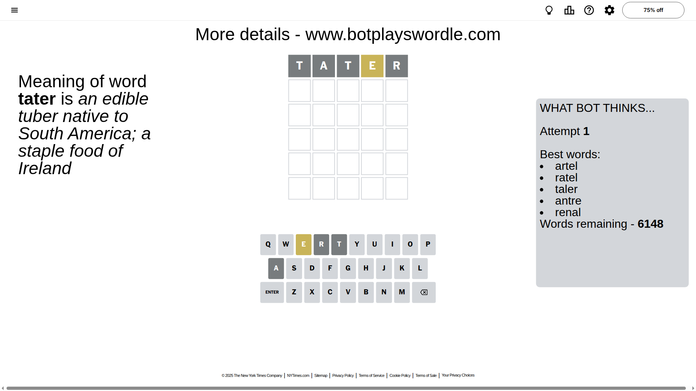
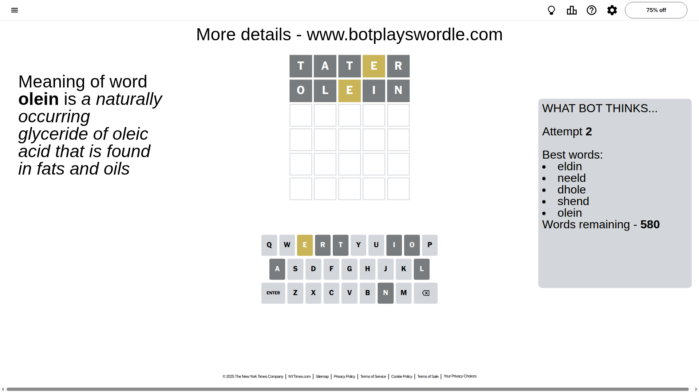
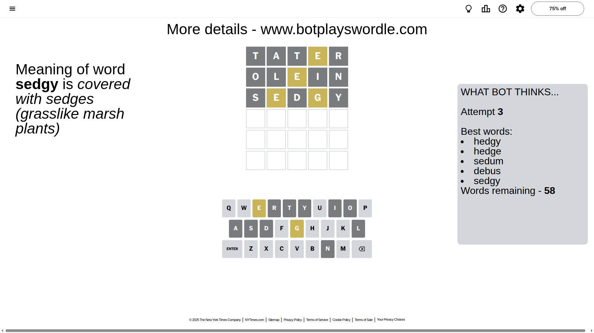
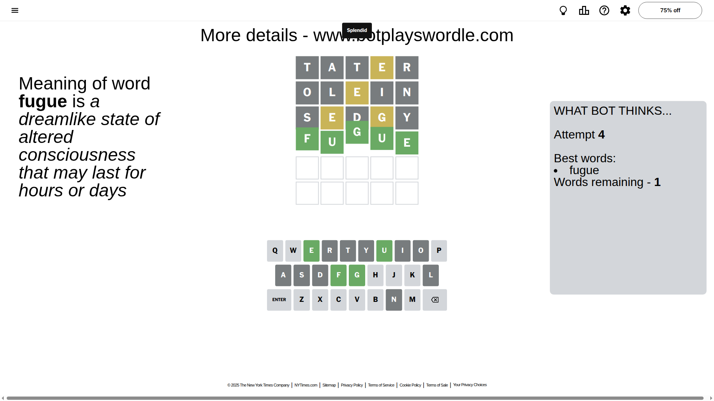

# Wordle for November 9, 2025 - \#1604

## Attempt 1

This is the first attempt and we'll choose a random word to start with.

Let's start with word `tater`

Attempt for `tater` gives us 0 correct letters, 1 present letters and 4 wrong letters.

If we look into details, we can see that:

Letter `t` is not present in the word and we will not use it any more

Letter `a` is not present in the word and we will not use it any more

Letter `t` is not present in the word and we will not use it any more

Letter `e` is on a different spot - this means that it cannot be at position 4

Letter `r` is not present in the word and we will not use it any more

Some letters are missing (like `t`, `a`, `r`) but it's also important piece of information

Word should contain letters `[e]`

That was a great guess that limited number of remaining words

## Attempt 2

Right now we have 580 words to choose from and best of them seem to be `[eldin neeld dhole shend olein]`

So far we know that possible letters are:

At position 1: `[b c d e f g h i j k l m n o p q s u v w x y z]`

At position 2: `[b c d e f g h i j k l m n o p q s u v w x y z]`

At position 3: `[b c d e f g h i j k l m n o p q s u v w x y z]`

At position 4: `[b c d f g h i j k l m n o p q s u v w x y z]`

At position 5: `[b c d e f g h i j k l m n o p q s u v w x y z]`

Next guess is `olein`, let's see what it gives us

Attempt for `olein` gives us 0 correct letters, 1 present letters and 4 wrong letters.

If we look into details, we can see that:

Letter `o` is not present in the word and we will not use it any more

Letter `l` is not present in the word and we will not use it any more

Letter `e` is on a different spot - this means that it cannot be at position 3

Letter `i` is not present in the word and we will not use it any more

Letter `n` is not present in the word and we will not use it any more

Some letters are missing (like `o`, `l`, `i`, `n`) but it's also important piece of information

Word should contain letters `[e]`

That was a great guess that limited number of remaining words

## Attempt 3

Right now we have 58 words to choose from and best of them seem to be `[hedgy hedge sedum debus sedgy]`

So far we know that possible letters are:

At position 1: `[b c d e f g h j k m p q s u v w x y z]`

At position 2: `[b c d e f g h j k m p q s u v w x y z]`

At position 3: `[b c d f g h j k m p q s u v w x y z]`

At position 4: `[b c d f g h j k m p q s u v w x y z]`

At position 5: `[b c d e f g h j k m p q s u v w x y z]`

Next guess is `sedgy`, let's see what it gives us

Attempt for `sedgy` gives us 0 correct letters, 2 present letters and 3 wrong letters.

If we look into details, we can see that:

Letter `s` is not present in the word and we will not use it any more

Letter `e` is on a different spot - this means that it cannot be at position 2

Letter `d` is not present in the word and we will not use it any more

Letter `g` is on a different spot - this means that it cannot be at position 4

Letter `y` is not present in the word and we will not use it any more

Some letters are missing (like `s`, `d`, `y`) but it's also important piece of information

Word should contain letters `[e g]`

That was a great guess that limited number of remaining words

## Attempt 4

Right now we have 1 words to choose from and best of them seem to be `[fugue]`

So far we know that possible letters are:

At position 1: `[b c e f g h j k m p q u v w x z]`

At position 2: `[b c f g h j k m p q u v w x z]`

At position 3: `[b c f g h j k m p q u v w x z]`

At position 4: `[b c f h j k m p q u v w x z]`

At position 5: `[b c e f g h j k m p q u v w x z]`

It must be `fugue`

That's the correct answer! The word is `fugue`!

## Conclusion

Today's word is `fugue` and it took 4 attempts to guess it

