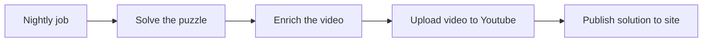
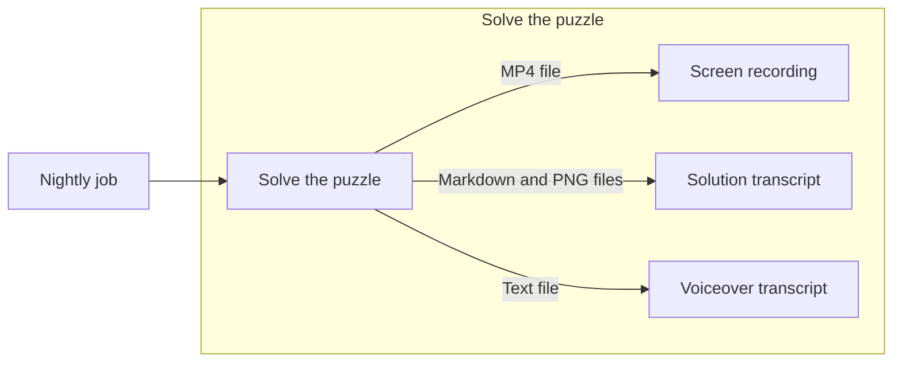
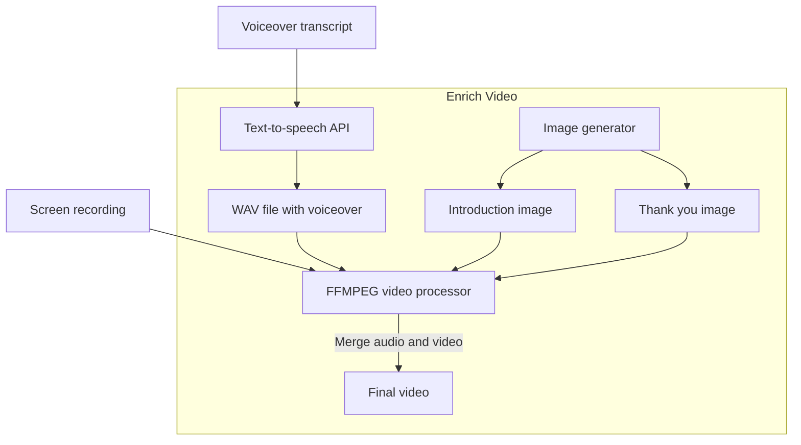
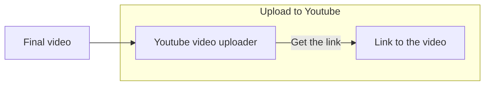
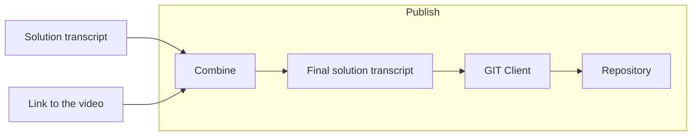
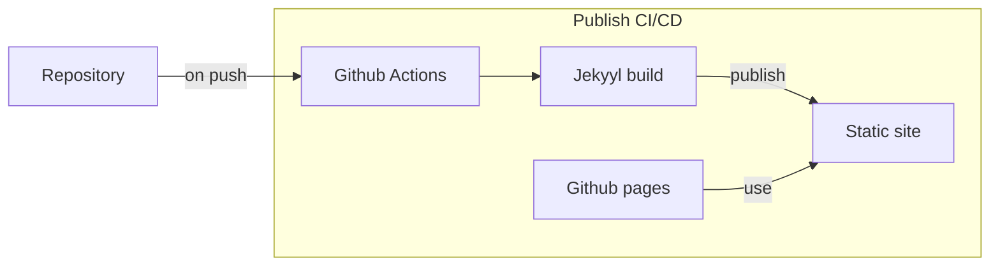

# How it technically works

If you came to this page it means that you want to know how the bot technically works. Probably here you will find answers to your questions.

## Technology stack

The bot is created using JavaScript stack and runs as [node.js](https://www.nodejs.org) scripts. Additionally a number of external `npm` modules are used:
- [puppeteer](https://www.npmjs.com/package/puppeteer) - node.js library that provides possibility to control Chrome or Chromium browser using DevTools protocol. It is heavily used for creating UI tests
- [puppeteer-screen-recorder](https://www.npmjs.com/package/puppeteer-screen-recorder) - plugin for puppeteer to record browser's window frame by frame
- [@google-cloud/text-to-speech](https://www.npmjs.com/package/@google-cloud/text-to-speech) - Google's Text-to-speech API library. Allows converting text to sythesized human speech
- [fluent-ffmpeg](https://www.npmjs.com/package/fluent-ffmpeg) - library that hides complexity of using `ffmpeg` CLI
- [youtube-videos-uploader](https://www.npmjs.com/package/youtube-videos-uploader) - library to upload vides on Youtube
- [canvas](https://www.npmjs.com/package/canvas) - library that brings canvas support to node.js. Basically you can do the same as with HTML Canvas in a browser
- [jekyll](https://jekyllrb.com/) - static site generator

Everything is hosted as [Github pages](https://docs.github.com/en/pages) and CI/CD is managed using [Github Actions](https://docs.github.com/en/actions).

## High-level flow

First of all it is important to understand what it takes bot to produce the solution.

The whole flow can be easily represented with several steps:

### Nightly job

Everything starts with a [scheduled job trigger](https://docs.github.com/en/actions/using-workflows/events-that-trigger-workflows#schedule) from [Github Actions](https://docs.github.com/en/actions).

As part of free plan Github offers 2000 free Github Actions minutes (see [here](https://docs.github.com/en/billing/managing-billing-for-github-actions/about-billing-for-github-actions) for more details). That is more than enough for bot use case - in average the whole worfklow takes around 5-7 minutes. Running it 31 times a month will hardly make it over 200 minutes.

So we can use it as a free CI/CD platform.

### Solve the puzzle

This step is the heart of the bot.

A number of components are used here: `puppeteer` and `puppeteer-screen-recorder`.

Basically the bot opens a browser and runs the solution session using `puppeteer` and making screenshot after each attempt.

In parallel the application runs a screen recording using `puppeteer-screen-recorder` module - it will give us a video file.

This can be depicted as following diagram:

This step produces 3 artifacts:
- MP4 file with screen recording
- Markdown of solution (what bot "thinks" while solving) and PNG screenshots of each guess
- Text file with transcript for voiceover

Also you can check [how it works](how_it_works.html) page to understand the logics behind the bot.

### Enrich the video

Technically this step is not required. However the output of `Solve the puzzle` step is just an MP4 file of screen recording. That looks quite boring.

We want to somehow enrich the video and make it more interesting to watch. Here are few things we can do:
- Add welcome image (or video fragment)
- Add final "thank you for watching" video fragment
- Add voiceover

The core of this step is `ffmpeg` - a powerful video processing tool. It can convert between different image/video formats, merge videos, add effects and many more.

First of all we'll generate a couple of images - "welcome" and "thank you". This can be done using `canvas` library - it allows to create images from node.js context. Then we can use `ffmpeg` to convert them to 5 seconds videos.

Next we need to generate an audio voiceover from a text file. When bot was solving the puzzle it generated a file containing timestamp and a text that should be narrated at that timestamp. Having this information at hand we can use `@google-cloud/text-to-speech` to generate a number of small audio files.

Refer to [pricing](https://cloud.google.com/text-to-speech/pricing) page for more details.

This service is also free for our use case - free plan includes 4 million monthly characters. Even if daily text is around 10'000 characters (that is already a lot!) then it will be around 300'000 characters per month - we are still far beyond the quota.

And finally using `ffmpeg` we can merge videos together ("welcome", main and "thank you") and add audio at required timestamps. This will give us final video.

Now let's take a look at the diagram of this step:

### Upload video to Youtube

When we come to this step we are done with video processing and ready for Youtube upload.

The process is really simple:

All the upload complexity is hidden inside `youtube-videos-uploader` module - it is very easy to use and it works like a charm!

The output of this step is a link to uploaded video - we will need it to put into the breakdown on the site.

### Publish solution to site

Once the link to Youtube video is know it should be injected into solution's transcript.

After it the transcript is ready and we can publish the results.

The site is built using `jekyll` site generator engine. As input it requires set of markdown files and staic assets. Output is HTML/JavaScript/CSS package that can be deployed.

`Jekyyl` is a nice tool for building static sites. It was chosen due to various reasons:
- Great support on Github pages
- Markdown-friendly
- Uses `Liquid` templating engine to process templates - it's powerful enough to do quite complex manipulations. For example - statistics section is generated using `Liquid`

## Hosting

The site is hosted using [Github pages](https://pages.github.com/) that comes for free as well (as all other components used for this project). It has certain limits (like 100GB traffic per month), but for the time being it is sufficient.

In addition to have nice looking domain name I bought [botplayswordle.com](https://www.botplayswordle.com) from [GoDaddy](https://www.godaddy.com).

